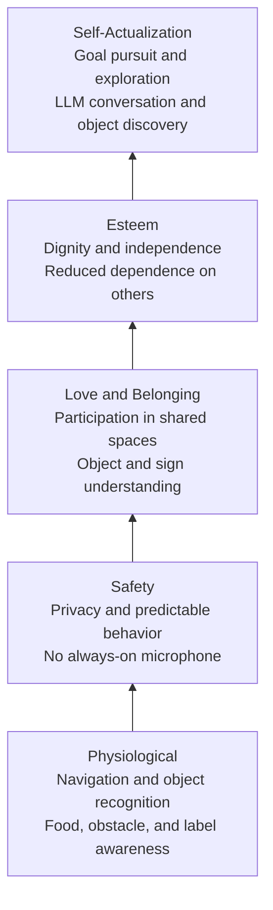
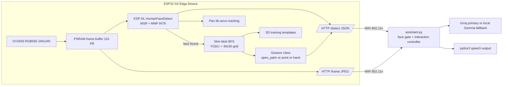
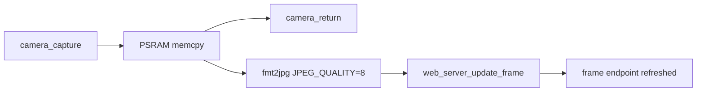
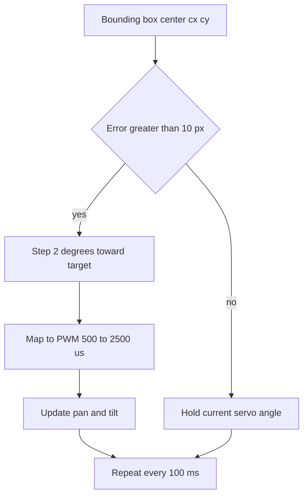
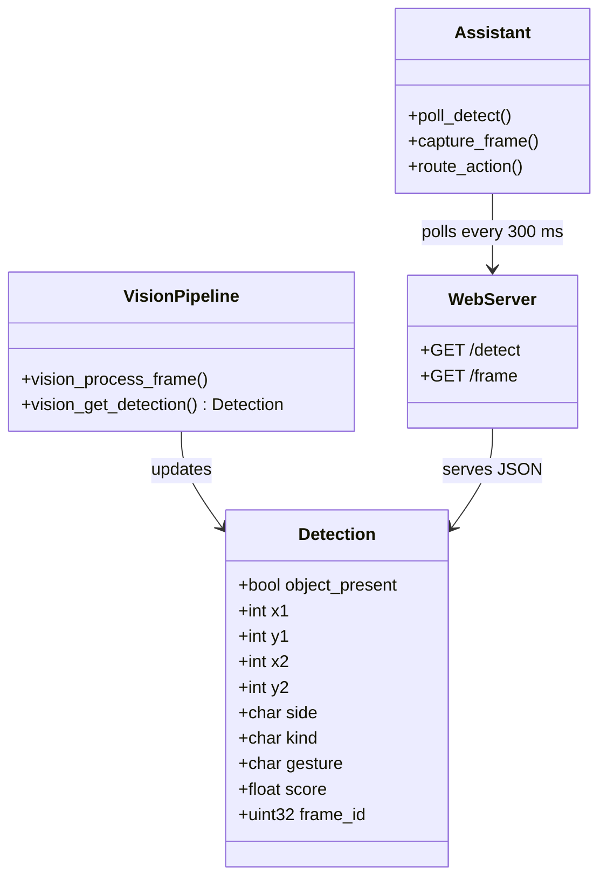
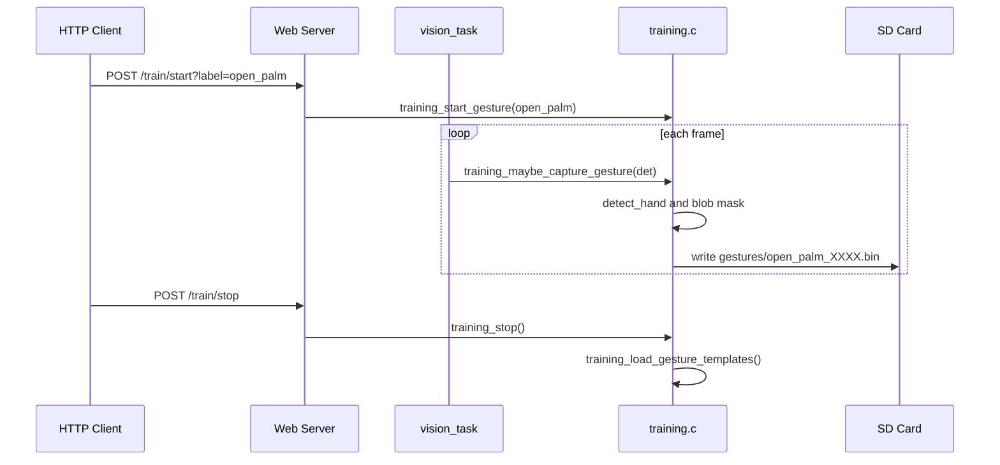
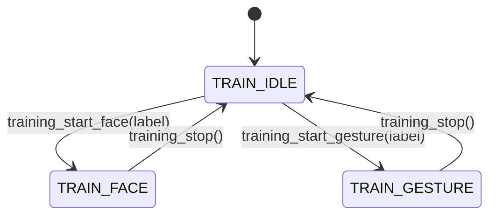
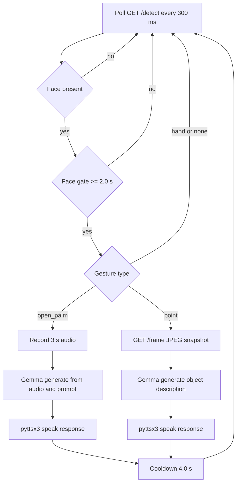

# MIRA — Multimodal Interactive Recognition Assistant
## Gesture-Activated Privacy-Preserving HCI for Blind Users
### CPRE5750 / HCI575 · Shobhit Singh · May 2026

---

## Slide 1 — Title

**MIRA: Multimodal Interactive Recognition Assistant**
*A Privacy-Preserving, Gesture-Activated HCI System for Blind and Visually Impaired Users*

| Field | Detail |
|---|---|
| Course | CPRE5750 / HCI575 — Computational Perception |
| Platform | Seeed XIAO ESP32-S3 Sense + Python Companion |
| LLM Backend | **Groq API** (llama-4-scout-17b, ~1–3 s) · local Gemma 4 2B fallback |
| Stack | ESP-IDF · FreeRTOS · ESP-DL · C/C++ · Python · Groq SDK |
| GitHub | https://github.com/Shi6aSK/MIRA |

---

## Slide 2 — Problem Statement

### Why existing systems fail blind users and privacy-conscious users

| Problem | Conventional Assistants | MIRA |
|---|---|---|
| **Activation** | Always-on mic / wake word | Explicit open-palm gesture |
| **Processing** | Cloud (Amazon, Google) | Edge + local LLM |
| **Screen** | Mandatory touchscreen | Zero-screen; OLED status only |
| **Data Egress** | Continuous audio/video stream | Selected frames + short clips |
| **Privacy** | Continuous cloud telemetry | Nothing sent without gesture gate |

> **Core thesis:** Vision processing local to the device, gesture-gated audio capture, and a local LLM eliminate the three principal failure modes of commercial assistants for blind users: always-on capture, cloud egress, and screen dependency.

---

## Slide 3 — Human Psychological Needs & Design Rationale

### Grounding in Self-Determination Theory (Deci & Ryan, 1985) and Maslow's Hierarchy

MIRA is not just a technical system — each design decision maps to a documented human psychological need, particularly salient for users with visual impairment.

---

#### 3a. The Three Core Needs (Self-Determination Theory)

| SDT Need | Definition | How MIRA Addresses It |
|---|---|---|
| **Autonomy** | The need to act as the author of one's own behavior; to initiate actions from self-chosen values rather than external pressure | Gesture-driven activation — the user *chooses* when the system listens. No wake word, no button press, no sighted assistant required. The user sets the pace. |
| **Competence** | The need to feel effective and capable in interactions with the environment | Consistent, predictable gesture vocabulary (`open_palm`, `point`) gives users a reliable mental model. Template IoU training allows the system to *learn the user's* specific gestures, not demand conformity to a factory model. |
| **Relatedness** | The need to feel connected and to participate in shared social and informational environments | Object identification (`point` gesture) and natural-language Q&A restore access to the ambient information sighted people take for granted: "What is on this shelf?", "What does this sign say?" — normalizing participation. |

---

#### 3b. Maslow's Hierarchy — Layer-by-Layer Mapping



---

#### 3c. Privacy as a Psychological Need

> *"Privacy is not secrecy — it is the capacity for self-determination over one's own information."*
> — Alan Westin, *Privacy and Freedom* (1967)

Blind users are disproportionately exposed to surveillance risk because:
- They cannot visually verify whether a device camera is active
- They cannot read on-screen indicators that recording is in progress
- They depend on voice interfaces that are **inherently always-on by design**

MIRA treats privacy as a **psychological safety requirement**, not a legal checkbox:

| Threat | Psychological Impact | MIRA Mitigation |
|---|---|---|
| Always-on camera | Constant vulnerability, loss of bodily autonomy | Camera DMA only active when `camera_is_enabled()` |
| Passive audio capture | Anxiety, chilling effect on speech | Audio starts only on `open_palm` + 2 s face gate |
| Cloud data harvesting | Loss of informational self-determination | Gemma 4 2B runs entirely local; zero external API calls |
| Unpredictable activation | Learned helplessness, loss of trust | Deterministic state machine: gate → gesture → action |

---

#### 3d. Explicit Activation as Psychological Design

The 2-second face-gate before any action is **intentional friction** — a concept from Human Factors design:

- **Reduces false triggers** that erode trust (competence need)
- **Gives the user time to compose intent** before the system acts (autonomy need)
- **Creates a clear feedback loop:** face detected → gate timer → gesture → response
- Mirrors how humans naturally signal readiness in face-to-face conversation (eye contact → pause → speak)

This maps to **Norman's Feedback Principle**: the system must keep users informed about what is happening, in a form that is perceptible, timely, and interpretable — critical for users who cannot see a screen.

---

## Slide 4 — System Architecture



---

## Slide 5 — Hardware Platform

### Seeed XIAO ESP32-S3 Sense

| Component | Spec | Role |
|---|---|---|
| **CPU** | Xtensa LX7 dual-core 240 MHz | FreeRTOS, vision task |
| **RAM** | 512 KB SRAM + 8 MB PSRAM | Frame buffer, ESP-DL tensors |
| **Flash** | 8 MB | Firmware + model weights |
| **Camera** | OV2640, RGB565 240×240 | Vision input |
| **Mic** | PDM MEMS | Audio capture (gated) |
| **WiFi** | 802.11b/g/n 2.4 GHz | HTTP stream + detect JSON |
| **Servos** | PWM GPIO 2 (pan), GPIO 3 (tilt) | Face tracking actuation |
| **OLED** | SSD1306 128×32 I²C | Status display |
| **SD Card** | SPI (CLK=7, MOSI=9, MISO=8, CS=21) | Gesture template storage |

**Key constraint:** No GPU. All inference must run on LX7 cores with PSRAM-backed tensor buffers.

Camera pins (DVP interface): XCLK=10, SIOD=40, SIOC=39, VSYNC=38, HREF=47, PCLK=13, Y2–Y9=15,17,18,16,14,12,11,48

---

## Slide 6 — Vision Pipeline (5 Stages)

### Stage 1 → Frame Capture & Buffer Management



- Camera frame (240×240×2 = **115,200 bytes** RGB565) copied to PSRAM *before* inference
- Camera DMA buffers freed immediately — avoids DMA collision with WiFi GDMA
- `vision_task` on **Core 1**, pinned, stack 32 KB

---

### Stage 2 → Face Detection (ESP-DL)

**Model:** `HumanFaceDetect` (MSRMNP_S8_V1) — INT8-quantized two-stage pipeline

| Stage | Network | Threshold |
|---|---|---|
| MSR (coarse) | MobileNet-style detector | `FACE_SCORE_MSR = 0.30` |
| MNP (refine) | Refinement network | `FACE_SCORE_MNP = 0.40` |

- Input: `dl::image::img_t` wrapping the PSRAM RGB565 buffer
- Output: bounding box `[x1,y1,x2,y2]`, confidence score
- Side classification: `cx < W/3` → "left", `cx > 2W/3` → "right", else "center"
- **Gate:** gesture detection only runs when `face_found == true`

---

### Stage 3 — Skin-Blob Detection (BFS on Block Grid)

**Color space:** YCbCr — robust to illumination changes vs. RGB thresholding

```c
// Pixel-level skin classifier
bool is_skin(int r, int g, int b) {
    // Luminance gate
    if (r < 95 || g < 40 || b < 20) return false;
    // Chrominance in YCbCr
    int cb = 128 + ((-43*r - 85*g + 128*b) >> 8);
    int cr = 128 + ((128*r - 107*g - 21*b) >> 8);
    return (cb >= 77 && cb <= 127 && cr >= 133 && cr <= 173);
}
```

**Block grid:** 8×8 pixel blocks → 30×30 grid (900 cells)
- Block is "skin" if ≥ 33% of pixels pass `is_skin()`
- BFS (flood-fill) finds largest connected skin component
- Minimum blob size: 6 blocks (`MIN_BLOB_CELLS`)

---

### Stage 4 — Gesture Classification

**Method:** Bounding-box aspect ratio of the largest skin blob

| Aspect Ratio (W/H) | Gesture | Semantic |
|---|---|---|
| `> 1.30` (wide) | `open_palm` | Activate microphone |
| `< 0.75` (narrow) | `point` | Capture frame, object query |
| otherwise | `hand` | Neutral / tracking only |

**Template IoU matching** (training mode):
- Binary 30×30 blob mask stored to SD card per labeled gesture
- At inference time: IoU(current\_mask, stored\_template) → best label
- Training hooks: `training_maybe_capture_gesture()` called every frame in `TRAIN_GESTURE` mode

---

### Stage 5 — Servo Pan/Tilt Tracking



- Pan: GPIO 2 (invert=0), Tilt: GPIO 3 (invert=1)
- Runtime invert flags configurable without reflash
- Tracking toggled via HTTP `GET /cmd?val=track_on|track_off`

---

## Slide 7 — Data Structures & Protocol

### `detection_t` (shared state, mutex-protected)

```c
typedef struct {
    bool     object_present;
    int      x1, y1, x2, y2;   // bounding box (pixels)
    char     side[8];            // "left" | "center" | "right"
    char     kind[12];           // "face" | "none"
    char     gesture[16];        // "open_palm" | "point" | "hand" | "none"
    float    score;              // face detection confidence
    uint32_t frame_id;           // monotonic counter
} detection_t;
```



### HTTP JSON response (`GET /detect`)

```json
{
  "frame_id": 42,
  "obj": 1,
  "kind": "face",
  "side": "center",
  "bbox": [60, 40, 180, 200],
  "gesture": "open_palm",
  "iou": 0.73
}
```

### UART Console Commands

| Command | Effect |
|---|---|
| `stream_on` | Enable JPEG + detect stream |
| `stream_off` | Disable stream |
| `track_on` | Enable servo tracking |
| `track_off` | Disable servo tracking |
| `status` | Print current detection state |

---

## Slide 8 — Training Subsystem

### On-Device Gesture Template Training



**State machine:** `TRAIN_IDLE → TRAIN_FACE → TRAIN_GESTURE → TRAIN_IDLE`



- Face samples: JPEG saved to `/sdcard/faces/<label>_NNNN.jpg`
- Gesture samples: binary blob mask (900 bytes) to `/sdcard/gestures/<label>_NNNN.bin`
- Templates scanned and validated at boot via `training_load_gesture_templates()`

---

## Slide 9 — Companion Laptop Application

### `tools/assistant.py` — Face-Gated Interaction Controller



### `tools/gemma_proxy.py` — 3-Tier LLM Backend

Priority chain (fastest → slowest):

| Priority | Backend | Model | Latency | Notes |
|---|---|---|---|---|
| **1 (primary)** | **Groq API** | `llama-4-scout-17b-16e-instruct` | **~1–3 s** | Free tier · `GROQ_API_KEY` env var |
| 2 (fallback) | HuggingFace Inference API | `Llama-3.2-11B-Vision-Instruct` | ~30–90 s | `HUGGINGFACEHUB_API_TOKEN` |
| 3 (offline) | Local Gemma 4 2B | safetensors · CPU | **~200 s** | No GPU acceleration on HP Aero 13 |

```python
# gemma_proxy.py — backend selection logic
if os.environ.get('GROQ_API_KEY'):
    response = run_groq(jpeg_bytes, prompt)   # llama-4-scout, ~1-3 s
elif os.environ.get('HUGGINGFACEHUB_API_TOKEN'):
    response = run_hf(jpeg_bytes, prompt)     # llama-3.2-11B, ~30-90 s
else:
    response = run_local(jpeg_bytes, prompt)  # Gemma 4 2B CPU, ~200 s
```

**Current deployment:** Groq API with `GROQ_API_KEY` reduces end-to-end response from ~200 s to ~1–3 s.

---

## Slide 10 — Privacy Architecture

### Privacy-by-Design Principles

```
Threat Model              Mitigation
──────────────────────────────────────────────────────────
Always-on mic capture  →  Audio starts ONLY after open_palm
                          gesture AND face present ≥ 2 s
                          
Continuous video egress →  Camera buffer freed before WiFi
                           /frame updated only from PSRAM copy
                           No video stream unless explicitly enabled
                           
Cloud data collection   →  Groq API (primary): JPEG sent only on explicit
                           gesture, never continuously streamed.
                           Local Gemma 4 2B (offline fallback): fully local,
                           zero network egress.
                           
Side-channel (DMA)      →  WiFi init before camera DMA start
                           3 s settling delay post-WiFi connect
```

**Data minimization:** 115 KB raw frame → 8-quality JPEG (~5–15 KB) → transmitted only on explicit gesture

---

## Slide 11 — Computational Constraints & Tradeoffs

### ESP32-S3 Resource Budget

| Resource | Total | Used | Notes |
|---|---|---|---|
| CPU | 240 MHz (2 cores) | Core 1: vision task | Core 0: WiFi/lwIP |
| SRAM | 512 KB | ~80 KB runtime | Stack + FreeRTOS |
| PSRAM | 8 MB | 115 KB frame buf + DL tensors | ~2–4 MB ESP-DL |
| Flash | 8 MB | Firmware + partitions | model in PSRAM |
| Inference latency | — | ~150–300 ms/frame | Two-stage MSR+MNP |
| Frame rate | ~5–10 FPS | Limited by DL inference | |

### Why NOT run full CNN gesture classification on-device?

- Gemma 4 2B: 2B parameters → impossible on 8 MB flash / 512 KB SRAM
- MobileNet-v3 gesture: ~3 MB model, needs float32 → PSRAM pressure
- **Solution:** BFS blob + aspect ratio = ~2 µs, zero model weight overhead
- Template IoU matching: 900-byte mask × N templates = trivial compute

---

## Slide 12 — Memory Architecture (FreeRTOS)

```
DRAM (512 KB)
├── FreeRTOS kernel + scheduler
├── Task stacks (vision: 32 KB, wifi, http...)
├── lwIP network buffers
└── ESP-DL: activation buffers (partial)

PSRAM (8 MB)  [MALLOC_CAP_SPIRAM]
├── s_frame_copy [115,200 bytes] ← 240×240×2 RGB565
├── s_det (HumanFaceDetect object + weights)
├── s_mask / s_vis / s_q [30×30 each] ← BFS arrays
└── HTTP JPEG buffer [~5–15 KB]

Flash (8 MB)
├── Bootloader (partition: factory)
├── App partition
└── NVS (WiFi credentials, config)

SD Card (SPI)
├── /gestures/<label>_NNNN.bin  [900 bytes each]
└── /faces/<label>_NNNN.jpg
```

Camera frame copy → PSRAM prevents DMA buffer starvation under long inference.

---

## Slide 13 — Gesture Set & Interaction Design

### Implemented Gestures

| Gesture | Visual Cue | Trigger | System Action |
|---|---|---|---|
| `open_palm` | Wide, flat hand (aspect > 1.30) | Face present ≥ 2 s | Begin 3 s audio recording |
| `point` | Vertical finger (aspect < 0.75) | Face present ≥ 2 s | Capture frame → Gemma query |
| `hand` | Neutral hand | — | Tracking only |
| `none` | No skin blob detected | — | Idle |

### Interaction Flow (User Perspective)

1. **Approach** device → face detected → OLED shows "face"
2. **Hold position** 2 seconds → face gate clears
3. **Show open palm** → microphone activates → speak query
4. **Lower hand** → recording stops → Gemma processes → TTS speaks answer
5. **Point at object** → camera captures → Gemma describes object

**Zero button presses. Zero screen interaction. Zero cloud upload.**

---

## Slide 14 — Results

### Achieved Capabilities

| Capability | Status | Notes |
|---|---|---|
| On-device face detection | ✅ | ESP-DL MSR+MNP, INT8 |
| Skin-blob gesture detection | ✅ | YCbCr, BFS, 30×30 grid |
| Pan/tilt servo tracking | ✅ | 2°/step, 10 px deadband |
| HTTP /detect + /frame endpoints | ✅ | JSON + JPEG over WiFi |
| UART console control | ✅ | 6 commands |
| SD card gesture training | ✅ | Binary masks + JPEG faces |
| Groq API (llama-4-scout-17b) | ✅ | ~1–3 s · gesture-gated JPEG upload |
| Local Gemma 4 2B inference | ✅ | CPU fallback · ~200 s · safetensors |
| Face-gated audio pipeline | ✅ | 2 s hold + 4 s cooldown |
| OLED status display | ✅ | SSD1306 128×32 |
| mmWave presence sensor | ⬜ | Proposed, not in current build |

### Quantitative Targets (from Proposal)

| Metric | Target | |
|---|---|---|
| Gesture recognition accuracy | > 85% | Template IoU matching |
| Speech interaction latency | < 2 s | Local Gemma, no cloud RTT |
| Servo response | < 100 ms/step | SERVO_TRACK_INTERVAL_MS |

---

## Slide 15 — Future Work

### Near-Term

| Extension | Technical Path |
|---|---|
| **mmWave presence gating** | LD2410 UART driver, Stage 1 pipeline enable/disable |
| **Richer gesture vocabulary** | Collect dataset → train TinyML classifier (MCUNetV2) |
| **llama.cpp int4 local inference** | Switch from PyTorch CPU (200 s) to GGUF int4 (est. 20–40 s) |
| **Whisper STT integration** | On-device ASR → text prompt before Groq/local LLM call |
| **Sign language recognition** | Temporal blob sequence → HMM classification |

### Long-Term

- **Mobile robot integration:** mount camera on wheeled robot for user following
- **Personalized face recognition:** embedded FaceNet lite for multi-user scenarios
- **On-device TTS:** eliminate Python companion for fully standalone operation
- **Audio VAD + I2S pipeline:** FFT-based voice activity detection before Whisper STT

---

## Slide 16 — Conclusion

### MIRA Demonstrates

1. **Privacy is an architectural decision** — not a feature you add later.
   Gesture-gating, local LLM, and minimal egress are load-bearing design choices.

2. **Classical CV is not dead on embedded systems.**
   YCbCr + BFS + aspect ratio achieves real-time gesture classification in <2 µs vs.
   CNN inference at 150–300 ms — right tool for the right constraint budget.

3. **Edge-host split is practical.**
   ESP32-S3 handles perception; laptop handles language. Clear separation of concerns
   with a simple JSON/HTTP protocol enables independent development.
   Groq API reduces LLM latency from ~200 s (CPU) to ~1–3 s without hardware changes.

4. **Explicit activation is better UX for accessibility.**
   Blind users benefit from predictable, gesture-triggered state transitions
   rather than probabilistic wake-word detection.

---

## Slide 17 — References & Links

**Project**
- GitHub: https://github.com/Shi6aSK/MIRA

**Hardware & Firmware**
- Espressif ESP32-S3 Technical Reference Manual — Rev 1.2
- ESP-IDF v6.0 — github.com/espressif/esp-idf
- ESP-DL (HumanFaceDetect MSR+MNP INT8) — github.com/espressif/esp-dl
- Seeed XIAO ESP32-S3 Sense product page — wiki.seeedstudio.com
- OmniVision OV2640 / OV5640 datasheets

**Vision & ML Papers**
- Howard et al. (2017) — MobileNets: Efficient CNNs for Mobile Vision (arXiv:1704.04861)
- Ji Lin et al. (2020) — MCUNet: Tiny Deep Learning on IoT Devices (NeurIPS 2020)
- Uboweja et al. (2023) — On-device Real-time Custom Hand Gesture Recognition (arXiv:2309.10858)
- Kakumanu et al. (2007) — Survey of Skin-Color Modeling: YCbCr classifier basis (Pattern Recognition 40(3))
- Chowdhery et al. (2019) — Visual Wake Words Dataset (arXiv:1906.05721)

**LLM Backends**
- Groq API / llama-4-scout-17b-16e-instruct — console.groq.com (free tier, ~1–3 s)
- Meta Llama 3.2 Vision (11B) — HuggingFace Inference API (fallback)
- Google Gemma 4 2B — ai.google.dev/gemma (local CPU fallback, ~200 s)
- Team Gemma (2024) — Gemma: Open Models Based on Gemini Research (arXiv:2403.08295)

**Python Libraries**
- pyttsx3 — offline TTS · pypi.org/project/pyttsx3
- sounddevice — PortAudio bindings · pypi.org/project/sounddevice
- scipy — audio processing · scipy.org
- requests — HTTP client · pypi.org/project/requests
- HuggingFace Transformers — huggingface.co/transformers

**Psychology & HCI**
- Deci & Ryan (1985) — Intrinsic Motivation and Self-Determination in Human Behavior
- Maslow (1943) — A Theory of Human Motivation (Psychological Review 50(4):370–396)
- Westin (1967) — Privacy and Freedom (Atheneum)
- Norman (2013) — The Design of Everyday Things (Basic Books)
