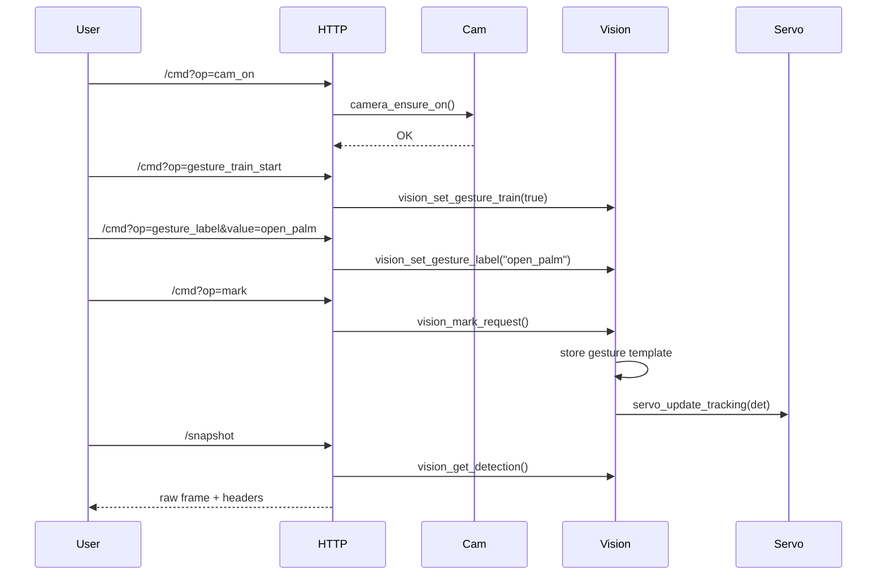
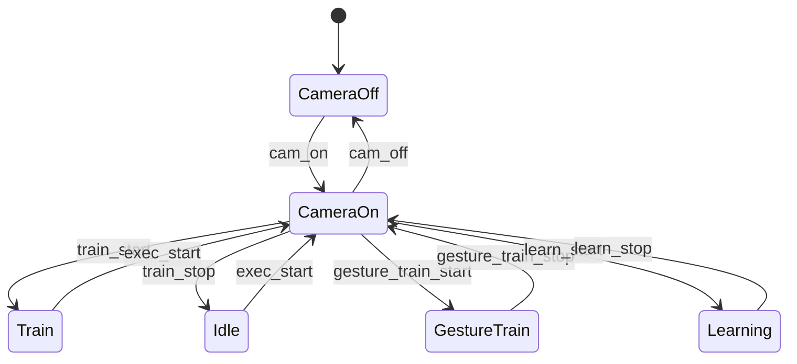

# MIRA — Machine-vision Interactive Recognition Assistant

Final project for CPRE 5750. MIRA is a small embedded vision assistant that runs on a Seeed XIAO ESP32S3 Sense. It watches a room through its built-in camera, tracks faces with two servos, recognizes hand gestures, and can describe what it sees using a vision LLM (Groq on a laptop over WiFi).

---

## What it does

- **Live camera stream** over WiFi (240×240 MJPEG) — open a browser, see the feed
- **Face detection** on-device using ESP-DL's MobileNet detector, ~10 fps
- **Servo pan/tilt** tracks the detected face — two SG90 servos on GPIO3/GPIO4
- **Gesture recognition** — open palm triggers the mic, pointing triggers a scene query
- **Scene description** — sends a snapshot to Groq's llama-4-scout, result shows in the web UI
- **Microphone capture** — records a 2s WAV to SD card on open-palm gesture
- **OLED "eyes"** — 128×32 SSD1306 draws eyes that follow the face

---

## Hardware

| Part | Details |
|---|---|
| MCU | Seeed XIAO ESP32S3 Sense (8MB PSRAM, 8MB Flash) |
| Camera | OV2640 built into the Sense expansion board |
| Servos | 2× SG90, pan on D2 (GPIO3), tilt on D3 (GPIO4) |
| OLED | SSD1306 128×32 I2C — SDA=GPIO5, SCL=GPIO6 |
| Mic | Built-in PDM mic on Sense expansion, CLK=GPIO42, DATA=GPIO41 |
| SD card | SPI via Sense expansion (CLK=7, MOSI=9, MISO=8, CS=21) |

---

## Project structure

```
main/
  main.c                  entry point + gesture trigger logic
  camera_control.c/h      OV2640 setup and frame helpers
  vision_pipeline.cpp     face detect, gesture detect, OLED eyes
  web_server.c/h          HTTP dashboard + all endpoints
  servo_control.c/h       MCPWM servo driver + proportional tracking
  oled_control.c/h        SSD1306 I2C driver
  mic_capture.c/h         PDM mic → WAV on SD card
  sd_card.c/h             SD card SPI mount
  wifi_manager.c/h        WiFi station
  vision_config.h         all GPIO pins and tuning constants

tools/
  gemma_proxy.py          runs on laptop, polls ESP32, calls Groq, posts result back
  vision_gui.py           optional desktop OpenCV viewer
  serial_viewer.py        serial monitor helper
  requirements.txt
```

---

## Building and flashing

You need [ESP-IDF v6.0](https://docs.espressif.com/projects/esp-idf/en/stable/esp32s3/get-started/index.html).

Before building, edit `main/vision_config.h` and set your WiFi credentials:
```c
#define WIFI_SSID  "your_network"
#define WIFI_PASS  "your_password"
```

Then:
```bash
idf.py build
idf.py -p COM5 flash
```

The ESP32 will print its IP address over serial on boot. Open that IP in a browser.

---

## Running the Groq proxy

The proxy script runs on a laptop connected to the same WiFi network. It polls the ESP32 for a trigger, grabs a snapshot, sends it to Groq, and posts the result back to the device.

Get a free API key at [console.groq.com](https://console.groq.com), then:

```bash
pip install -r tools/requirements.txt
$env:GROQ_API_KEY = "gsk_..."
python tools/gemma_proxy.py 192.168.x.x
```

If no API key is set it will fall back to a local Gemma 4 model — put the weights in `gemma/` (see below). That works but is very slow without a GPU.

---

## Local Gemma 4 (optional fallback)

```bash
pip install huggingface_hub
huggingface-cli download google/gemma-4 --local-dir gemma/
```

---

## Notes

- The camera uses `GRAB_WHEN_EMPTY` mode with a single frame buffer to avoid DMA conflicts with the WiFi stack in PSRAM — took a while to figure that one out
- Face detection thresholds are set lower than default (0.20/0.30) because the OV2640 image quality is quite poor and the model confidence scores are consistently low
- Servo direction depends on physical mounting; `SERVO_PAN_INVERT` and `SERVO_TILT_INVERT` in `vision_config.h` flip the direction if needed

---

## License

MIT

---

## What it does

| Feature | Detail |
|---|---|
| **Live MJPEG stream** | 240×240 RGB565 from OV2640, served over WiFi at `http://<IP>/stream` |
| **Face detection** | ESP-DL MobileNet face detector running on-device at ~10 fps |
| **Servo gaze tracking** | Pan + tilt servos follow the detected face in real time |
| **Gesture recognition** | Skin-blob heuristic detects **open palm** and **point** gestures |
| **Scene description** | Groq `llama-4-scout` (or local Gemma 4) describes the current frame in plain English |
| **Point-triggered query** | Pointing gesture auto-triggers "what is being pointed at?" query |
| **Microphone capture** | Open-palm gesture records a 2-second WAV via the built-in PDM mic to SD card |
| **OLED "eyes"** | 128×32 SSD1306 OLED displays animated eyes that track the face |
| **Web dashboard** | Single-page UI for live view, detection overlay, servo controls, and Gemma panel |

---

## Hardware

- **MCU:** Seeed XIAO ESP32S3 Sense (8 MB OPI PSRAM, 8 MB Flash)
- **Camera:** OV2640 (built-in on Sense expansion board), 240×240, RGB565
- **Servos:** 2× SG90 — pan on GPIO3 (D2), tilt on GPIO4 (D3)
- **OLED:** SSD1306 128×32 I2C at address 0x3C — SDA GPIO5, SCL GPIO6
- **Microphone:** Built-in PDM mic on Sense expansion — CLK GPIO42, DATA GPIO41
- **SD card:** SPI on Sense expansion board (CLK=7, MOSI=9, MISO=8, CS=21)

---

## Software architecture

```
MIRA/
├── main/
│   ├── main.c               # App entry point, vision task, gesture trigger logic
│   ├── camera_control.c/h   # OV2640 init, frame capture/return helpers
│   ├── vision_pipeline.cpp  # Face detection (ESP-DL), gesture detection, OLED eyes
│   ├── vision_types.h       # Shared detection result structs
│   ├── vision_stream.c/h    # MJPEG async streaming (chunked HTTP)
│   ├── web_server.c/h       # HTTP dashboard, /snap, /gemma, /servo endpoints
│   ├── servo_control.c/h    # MCPWM servo driver, proportional tracking
│   ├── oled_control.c/h     # SSD1306 I2C driver, animated eyes
│   ├── mic_capture.c/h      # I2S PDM microphone → WAV file on SD card
│   ├── sd_card.c/h          # SD card SPI mount
│   ├── wifi_manager.c/h     # WiFi station init
│   ├── training.c/h         # In-browser face-label training stubs
│   ├── uart_console.c/h     # USB-serial debug console
│   └── vision_config.h      # All GPIO pins and tuning constants
├── tools/
│   ├── gemma_proxy.py       # Python proxy: polls ESP32, sends frame to Groq/Gemma, posts result back
│   ├── vision_gui.py        # Desktop OpenCV viewer (optional)
│   ├── serial_viewer.py     # Serial monitor helper
│   └── requirements.txt     # Python dependencies
├── gemma/                   # Local Gemma 4 model config (weights not included – see below)
│   ├── config.json
│   ├── tokenizer.json
│   └── ...
├── CMakeLists.txt
└── sdkconfig                # ESP-IDF project config
```

---

## How it was built

### Firmware (ESP-IDF)

Written in **C / C++** using **ESP-IDF v6.0**. Key components:

- **Camera:** `espressif/esp32-camera` managed component. Configured with `CAMERA_GRAB_WHEN_EMPTY` + `fb_count=1` to avoid PSRAM DMA contention with WiFi.
- **Face detection:** `esp-dl` MobileNet face detector. Confidence thresholds tuned down (`MSR=0.20`, `MNP=0.30`) to handle the OV2640's noisy output.
- **Gesture detection:** Custom skin-blob detector in `vision_pipeline.cpp`. Segments skin-coloured 8×8 blocks, fits a bounding box, and classifies by aspect ratio + position relative to the face.
- **Servo tracking:** ESP MCPWM driver. Proportional control: error = face centre − frame centre, servo moves proportionally, with a 5 px deadband and 100 ms update interval.
- **OLED:** Bit-banged I2C SSD1306 driver drawing ellipse "eyes" that shift in the direction of face offset, mirrored to match physical mounting.
- **Microphone:** ESP-IDF `i2s_channel` API in PDM-RX mode (16 kHz, 16-bit mono). `mic_capture_async()` creates a FreeRTOS task that streams I2S reads to a WAV file on the SD card.
- **Web server:** `esp_http_server` with 10 URI handlers. MJPEG is streamed using chunked transfer encoding on a dedicated background task.

### Gemma Proxy (Python)

`tools/gemma_proxy.py` runs on a laptop on the same WiFi network:

1. Polls `GET /gemma` on the ESP32 every second for a pending trigger.
2. Fetches a JPEG snapshot via `GET /snap`.
3. Sends image + prompt to **Groq** (`llama-4-scout-17b-16e-instruct`) — free tier, ~1–3 s.
4. Falls back to **HuggingFace Inference API** if Groq is unavailable.
5. Falls back to **local Gemma 4** (`gemma/`) if no API keys are set (requires `torch` + `transformers`, slow on CPU).
6. POSTs the text result back to `POST /gemma_result` on the ESP32 for display in the dashboard.

Two prompts are used depending on context:
- `describe` (manual button / default): general scene description
- `point` (pointing gesture auto-trigger): "what is the object being pointed at?"

---

## Setup

### 1. Flash firmware

Install [ESP-IDF v6.0](https://docs.espressif.com/projects/esp-idf/en/stable/esp32s3/get-started/index.html), then:

```bash
idf.py build
idf.py -p COM5 flash
```

Edit `main/vision_config.h` to set your WiFi SSID/password and adjust GPIO pins if needed.

### 2. Run the Gemma proxy

```bash
pip install -r tools/requirements.txt

# Fastest (free Groq key from https://console.groq.com)
$env:GROQ_API_KEY = "gsk_..."
python tools/gemma_proxy.py 192.168.x.x   # ESP32 IP shown in serial monitor
```

### 3. Open the dashboard

Navigate to `http://<ESP32-IP>` in a browser on the same WiFi network.

---

## Local Gemma 4 model (optional)

Download the model weights from HuggingFace and place them in `gemma/`:

```bash
pip install huggingface_hub
huggingface-cli download google/gemma-4 --local-dir gemma/
```

The proxy will use it automatically when no API keys are set.

---

## License

MIT

Face and gesture detection on the XIAO ESP32S3 Sense, with Gemma 4 2B responses on the laptop.

## Quick Start

### 1. Flash the firmware

```bash
# In ESP-IDF terminal from project root:
idf.py build flash monitor
```

### 2. Run the assistant (headless, recommended)

```bash
cd tools
pip install -r requirements.txt
python assistant.py --host http://192.168.X.X
```

The assistant:
- Polls ESP `/detect` over HTTP and captures frames from `/stream`
- Loads the local Gemma 4 2B model from `gemma/`
- Uses a face-gated interaction flow:
  - Detect face first
  - If gesture is `open_palm`: record short voice audio and send to Gemma
  - If gesture is `point`: capture frame and ask Gemma "what is the object being pointed at?"

### 3. Run the full GUI (optional)

```bash
python tools/serial_viewer.py
```

Connect using port `COM5` (or whatever COM port the ESP appears as), baud `921600`, mode `RAW_GRAY`.

---

## Architecture

```
ESP32S3 (XIAO Sense)                     Laptop
┌─────────────────────┐                  ┌──────────────────────────────┐
│  OV2640 camera      │  USB-JTAG serial │  serial_viewer.py  (GUI)     │
│  240×240 RGB565     │ ──────────────►  │   or                         │
│  Skin-blob detector │  FRAME RAW_GRAY  │  assistant.py  (headless)    │
│  Face + gated gest. │  DETECT JSON     │                              │
│  Servo pan/tilt     │ ◄────────────── │  → Gemma 4 2B (local CPU)    │
│  USB-JTAG console   │  CMD text lines  │  → pyttsx3 TTS (optional)    │
└─────────────────────┘                  └──────────────────────────────┘
```

## Detection output (DETECT JSON)

```json
{
  "frame_id": 42,
  "obj": 1,
  "kind": "face",        // "face" | "none"
  "side": "center",      // "left" | "center" | "right"
  "bbox": [x1,y1,x2,y2],
  "gesture": "none",     // for face: "open_palm" | "point" | "hand" | "none"
  "iou": 0.0
}
```

## Console commands (sent from PC via USB-JTAG)

| Command | Effect |
|---------|--------|
| `stream_on` | Enable raw-frame + detection stream |
| `stream_off` | Disable stream |
| `track_on` | Enable servo face-tracking |
| `track_off` | Disable servo tracking |
| `status` | Print current detection state |

---


  class CameraControl {
    +camera_ensure_on()
    +camera_ensure_off()
    +camera_is_enabled()
  }
  class VisionPipeline {
    +vision_process_frame()
    +vision_set_mode()
    +vision_mark_request()
    +vision_set_gesture_label()
  }
  class TemplateStore {
    +template_add()
    +template_match()
  }
  class GestureStore {
    +gesture_template_add()
    +gesture_template_match()
  }
  class ServoControl {
    +servo_init()
    +servo_update_tracking()
  }
  class HttpServer {
    +/raw
    +/snapshot
    +/status
    +/cmd
  }
  class UartConsole {
    +uart_console_task()
  }

  CameraControl --> VisionPipeline
  VisionPipeline --> TemplateStore
  VisionPipeline --> GestureStore
  VisionPipeline --> ServoControl
  HttpServer --> VisionPipeline
  UartConsole --> VisionPipeline
```

## UML: Command and capture sequence



## UML: Camera and mode state



## Training and data collection

### Object templates (obstacle vs anomaly)

- Set mode to train: `/cmd?op=train_start`.
- Place the target object in view.
- Send `/cmd?op=mark` to store a template.
- Exit training: `/cmd?op=exec_start`.

### Gesture templates (per-label)

- Start gesture training: `/cmd?op=gesture_train_start`.
- Set label: `/cmd?op=gesture_label&value=open_palm`.
- Perform the gesture, then `/cmd?op=mark` to store.
- Stop gesture training: `/cmd?op=gesture_train_stop`.

### Snapshot capture (dataset)

- Use `/snapshot` to download the current raw grayscale frame.
- Response headers include metadata:
  - `X-Width`, `X-Height`, `X-Frame-Id`
  - `X-Obj-Present`, `X-Obj-Kind`, `X-Obj-Side`, `X-BBox`
  - `X-Gesture`, `X-Pan`, `X-Tilt`, `X-Tracking`

These snapshots can be paired with the gesture label used during training to build datasets.

## Servo tracking

- Pan and tilt pins come from the Theo1.0 mapping (`SERVO_PAN_GPIO=2`, `SERVO_TILT_GPIO=3`).
- Tracking adjusts the servos using the bbox center and a deadband.
- Toggle tracking with `/cmd?op=track_on` and `/cmd?op=track_off`.

## HTTP API

- `/` Web UI for live raw view and controls.
- `/raw` Raw grayscale frame (binary).
- `/snapshot` Raw grayscale frame with metadata headers.
- `/status` JSON telemetry.
- `/cmd` Command endpoint.

### Command list

- `cam_on`, `cam_off`
- `train_start`, `train_stop`, `exec_start`, `mark`
- `learn_start`, `learn_stop`, `bg_clear`
- `templates_clear`, `templates_list`
- `gesture_train_start`, `gesture_train_stop`
- `gesture_label` (use `value=`), `gesture_clear`, `gesture_list`
- `pan` (use `value=`), `tilt` (use `value=`), `center`
- `track_on`, `track_off`
- `calib`

## UART console

UART commands mirror the HTTP commands. Examples:

- `pan 90`
- `tilt 110`
- `gesture_label open_palm`
- `gesture_train_start`
- `mark`

## Build and flash

This project builds the external vision sources via [main/CMakeLists.txt](main/CMakeLists.txt).

Typical ESP-IDF flow:

- `idf.py build`
- `idf.py flash`
- `idf.py monitor`

## Notes and known limits

- The current build is near the smallest app partition limit; increase the app partition size if you add features.
- The mmWave presence stage from the proposal is not active yet.
- Wi-Fi credentials are configured in the vision config header (update them before deployment).

## Latency tuning for Gemma

Use these optional environment variables on the host to trade response quality for speed:

- `GEMMA_FAST_MODE=1` (default) caps long responses for lower latency
- `GEMMA_DEFAULT_MAX_NEW_TOKENS=72` sets default response length cap
- `GEMMA_CPU_THREADS=<n>` limits CPU threads to keep UI/network responsive
- `GEMMA_HF_TIMEOUT_SEC=45` sets HuggingFace inference timeout in fallback mode

## Recent updates — Computational Perception & Desktop LLM

- On-device perception changes:
  - Camera configured for RGB565 QVGA capture; vision pipeline simplified to a lightweight color-based face/skin detector and a block-grid gesture representation. This prioritizes fast, low-power detection on the ESP32-S3 rather than full CNN inference on-device.
  - Overlays were removed from the live framebuffer to minimize processing and memory use; detections are reported as concise metadata (kind/side/bbox) over UART/HTTP.

- Streaming & desktop integration:
  - Firmware can stream JPEG frames over the console UART using a simple framed protocol: send `FRAME <len>\n` then `<len>` JPEG bytes. This enables a low-latency desktop viewer without the overhead of HTTP.
  - A desktop GUI `tools/serial_viewer.py` reads this protocol, displays live frames, and provides capture/record buttons. The GUI can also load a local Gemma 4 (2B) model via `tools/gemma_runner.py` to perform the heavier language-model and inference tasks off-device.

- Local LLM (Gemma) notes:
  - Place the Gemma model folder in `sample_project/gemma` (model files included if provided). The runner attempts to load the model locally using `transformers` + `torch` and exposes a `generate(prompt)` wrapper for use in the GUI.
  - Loading large models on CPU may be slow; GPU is recommended if available. Quantized/optimized runtimes are recommended for improved performance.

- How this split maps to computational perception goals:
  - Edge (ESP32-S3): perform only the minimal, fast perception tasks required to detect presence, faces, and gestures — produce compact metadata and short snapshots.
  - Host (Laptop): run heavier models (LLMs, large detectors, object recognizers) against captured frames or user prompts to provide richer UI and reasoning while keeping raw data transfer minimal and user-controlled.

If you'd like, I can add a short `docs/README_SERIAL.md` with exact protocol examples and screenshots of the GUI, or extend `tools/serial_viewer.py` to auto-save incoming frames to a dataset folder for model training.
