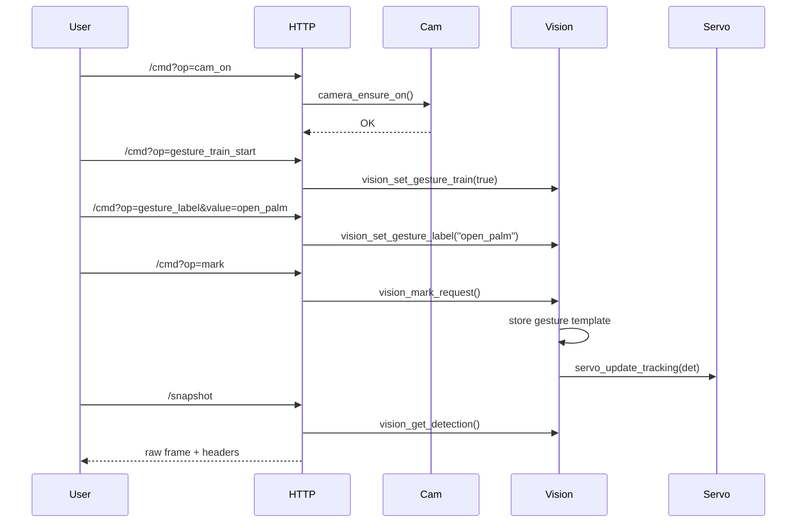
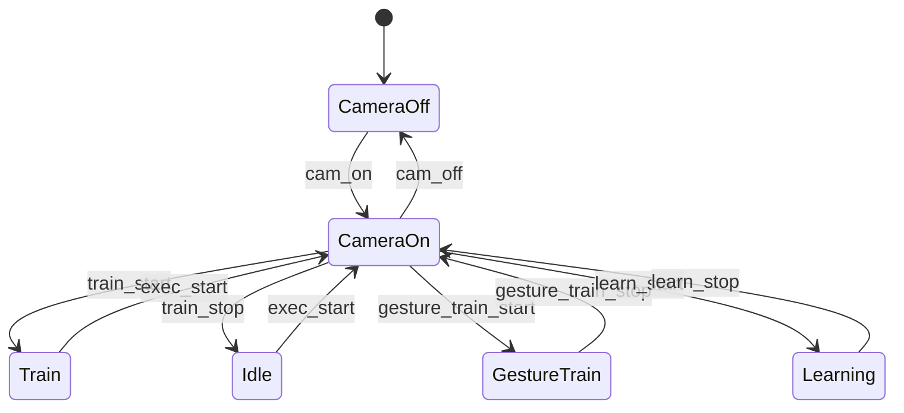

# ESP32-S3 Vision Assistant (CPRE5750)

Face and gesture detection on the XIAO ESP32S3 Sense, with Gemma 4 2B responses on the laptop.

## Quick Start

### 1. Flash the firmware

```bash
# In ESP-IDF terminal from project root:
idf.py build flash monitor
```

### 2. Run the assistant (headless, recommended)

```bash
cd tools
pip install -r requirements.txt
python assistant.py --host http://192.168.X.X
```

The assistant:
- Polls ESP `/detect` over HTTP and captures frames from `/stream`
- Loads the local Gemma 4 2B model from `gemma/`
- Uses a face-gated interaction flow:
  - Detect face first
  - If gesture is `open_palm`: record short voice audio and send to Gemma
  - If gesture is `point`: capture frame and ask Gemma "what is the object being pointed at?"

### 3. Run the full GUI (optional)

```bash
python tools/serial_viewer.py
```

Connect using port `COM5` (or whatever COM port the ESP appears as), baud `921600`, mode `RAW_GRAY`.

---

## Architecture

```
ESP32S3 (XIAO Sense)                     Laptop
┌─────────────────────┐                  ┌──────────────────────────────┐
│  OV2640 camera      │  USB-JTAG serial │  serial_viewer.py  (GUI)     │
│  240×240 RGB565     │ ──────────────►  │   or                         │
│  Skin-blob detector │  FRAME RAW_GRAY  │  assistant.py  (headless)    │
│  Face + gated gest. │  DETECT JSON     │                              │
│  Servo pan/tilt     │ ◄────────────── │  → Gemma 4 2B (local CPU)    │
│  USB-JTAG console   │  CMD text lines  │  → pyttsx3 TTS (optional)    │
└─────────────────────┘                  └──────────────────────────────┘
```

## Detection output (DETECT JSON)

```json
{
  "frame_id": 42,
  "obj": 1,
  "kind": "face",        // "face" | "none"
  "side": "center",      // "left" | "center" | "right"
  "bbox": [x1,y1,x2,y2],
  "gesture": "none",     // for face: "open_palm" | "point" | "hand" | "none"
  "iou": 0.0
}
```

## Console commands (sent from PC via USB-JTAG)

| Command | Effect |
|---------|--------|
| `stream_on` | Enable raw-frame + detection stream |
| `stream_off` | Disable stream |
| `track_on` | Enable servo face-tracking |
| `track_off` | Disable servo tracking |
| `status` | Print current detection state |

---


  class CameraControl {
    +camera_ensure_on()
    +camera_ensure_off()
    +camera_is_enabled()
  }
  class VisionPipeline {
    +vision_process_frame()
    +vision_set_mode()
    +vision_mark_request()
    +vision_set_gesture_label()
  }
  class TemplateStore {
    +template_add()
    +template_match()
  }
  class GestureStore {
    +gesture_template_add()
    +gesture_template_match()
  }
  class ServoControl {
    +servo_init()
    +servo_update_tracking()
  }
  class HttpServer {
    +/raw
    +/snapshot
    +/status
    +/cmd
  }
  class UartConsole {
    +uart_console_task()
  }

  CameraControl --> VisionPipeline
  VisionPipeline --> TemplateStore
  VisionPipeline --> GestureStore
  VisionPipeline --> ServoControl
  HttpServer --> VisionPipeline
  UartConsole --> VisionPipeline
```

## UML: Command and capture sequence



## UML: Camera and mode state



## Training and data collection

### Object templates (obstacle vs anomaly)

- Set mode to train: `/cmd?op=train_start`.
- Place the target object in view.
- Send `/cmd?op=mark` to store a template.
- Exit training: `/cmd?op=exec_start`.

### Gesture templates (per-label)

- Start gesture training: `/cmd?op=gesture_train_start`.
- Set label: `/cmd?op=gesture_label&value=open_palm`.
- Perform the gesture, then `/cmd?op=mark` to store.
- Stop gesture training: `/cmd?op=gesture_train_stop`.

### Snapshot capture (dataset)

- Use `/snapshot` to download the current raw grayscale frame.
- Response headers include metadata:
  - `X-Width`, `X-Height`, `X-Frame-Id`
  - `X-Obj-Present`, `X-Obj-Kind`, `X-Obj-Side`, `X-BBox`
  - `X-Gesture`, `X-Pan`, `X-Tilt`, `X-Tracking`

These snapshots can be paired with the gesture label used during training to build datasets.

## Servo tracking

- Pan and tilt pins come from the Theo1.0 mapping (`SERVO_PAN_GPIO=2`, `SERVO_TILT_GPIO=3`).
- Tracking adjusts the servos using the bbox center and a deadband.
- Toggle tracking with `/cmd?op=track_on` and `/cmd?op=track_off`.

## HTTP API

- `/` Web UI for live raw view and controls.
- `/raw` Raw grayscale frame (binary).
- `/snapshot` Raw grayscale frame with metadata headers.
- `/status` JSON telemetry.
- `/cmd` Command endpoint.

### Command list

- `cam_on`, `cam_off`
- `train_start`, `train_stop`, `exec_start`, `mark`
- `learn_start`, `learn_stop`, `bg_clear`
- `templates_clear`, `templates_list`
- `gesture_train_start`, `gesture_train_stop`
- `gesture_label` (use `value=`), `gesture_clear`, `gesture_list`
- `pan` (use `value=`), `tilt` (use `value=`), `center`
- `track_on`, `track_off`
- `calib`

## UART console

UART commands mirror the HTTP commands. Examples:

- `pan 90`
- `tilt 110`
- `gesture_label open_palm`
- `gesture_train_start`
- `mark`

## Build and flash

This project builds the external vision sources via [main/CMakeLists.txt](main/CMakeLists.txt).

Typical ESP-IDF flow:

- `idf.py build`
- `idf.py flash`
- `idf.py monitor`

## Notes and known limits

- The current build is near the smallest app partition limit; increase the app partition size if you add features.
- The mmWave presence stage from the proposal is not active yet.
- Wi-Fi credentials are configured in the vision config header (update them before deployment).

## Latency tuning for Gemma

Use these optional environment variables on the host to trade response quality for speed:

- `GEMMA_FAST_MODE=1` (default) caps long responses for lower latency
- `GEMMA_DEFAULT_MAX_NEW_TOKENS=72` sets default response length cap
- `GEMMA_CPU_THREADS=<n>` limits CPU threads to keep UI/network responsive
- `GEMMA_HF_TIMEOUT_SEC=45` sets HuggingFace inference timeout in fallback mode

## Recent updates — Computational Perception & Desktop LLM

- On-device perception changes:
  - Camera configured for RGB565 QVGA capture; vision pipeline simplified to a lightweight color-based face/skin detector and a block-grid gesture representation. This prioritizes fast, low-power detection on the ESP32-S3 rather than full CNN inference on-device.
  - Overlays were removed from the live framebuffer to minimize processing and memory use; detections are reported as concise metadata (kind/side/bbox) over UART/HTTP.

- Streaming & desktop integration:
  - Firmware can stream JPEG frames over the console UART using a simple framed protocol: send `FRAME <len>\n` then `<len>` JPEG bytes. This enables a low-latency desktop viewer without the overhead of HTTP.
  - A desktop GUI `tools/serial_viewer.py` reads this protocol, displays live frames, and provides capture/record buttons. The GUI can also load a local Gemma 4 (2B) model via `tools/gemma_runner.py` to perform the heavier language-model and inference tasks off-device.

- Local LLM (Gemma) notes:
  - Place the Gemma model folder in `sample_project/gemma` (model files included if provided). The runner attempts to load the model locally using `transformers` + `torch` and exposes a `generate(prompt)` wrapper for use in the GUI.
  - Loading large models on CPU may be slow; GPU is recommended if available. Quantized/optimized runtimes are recommended for improved performance.

- How this split maps to computational perception goals:
  - Edge (ESP32-S3): perform only the minimal, fast perception tasks required to detect presence, faces, and gestures — produce compact metadata and short snapshots.
  - Host (Laptop): run heavier models (LLMs, large detectors, object recognizers) against captured frames or user prompts to provide richer UI and reasoning while keeping raw data transfer minimal and user-controlled.
